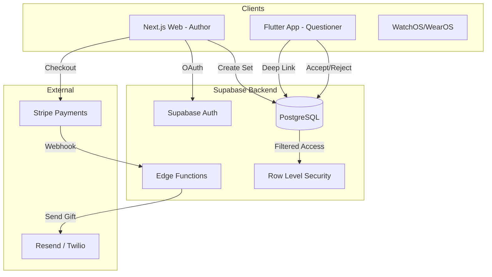

# Project M8: Architecture & Design Master

This document serves as the high-level technical hub for the Project M8 ecosystem. It outlines the core philosophy, technology choices, and data flows that govern the mystical experience.

## 🌌 1. Core Philosophy: Zero UI
M8 is designed to feel like a "physical artifact" rather than a mobile application.
- **Motion-First**: The primary interaction is the device shake.
- **Minimal Chrome**: Hidden menus, gesture-based history, and focus on the high-performance `OrbPainter`.
- **Aesthetic Excellence**: High-density typography (Outfit/Inter), glassmorphism, and hardware-accelerated shaders.

## 🛠️ 2. Technology Stack

| Layer | Technology | Rationale |
|:---|:---|:---|
| **Questioner (App)** | **Flutter 3.x** | Impeller/Skia engine for 120fps animations on Wearables (Watch) & Mobile. |
| **Creator (Web)** | **Next.js 16** | Desktop-grade dashboard with real-time CSS/Canvas device simulation. |
| **Backend (BaaS)** | **Supabase** | Relational integrity (Postgres) + Realtime + RLS Security out of the box. |
| **Payments** | **Stripe** | Seamless $2/set transaction flow with SCA compliance. |

## 📁 2.1 Repository Layout

```plaintext
/
├── apps/
│   ├── m8_app/             # Flutter (Questioner App)
│   └── m8_web/             # Next.js (Creator Dashboard)
├── infra/
│   └── supabase/           # PostgreSQL Migrations & Edge Functions
├── packages/
│   └── shared/             # Shared TypeScript types & validation logic
├── specs/                  # Feature technical specifications (001-0XX)
└── PRD.md                  # Master Product Requirements Document
```

## 🏗️ 3. System Architecture



## 🔐 4. Data Flows & Security

### 4.1 The Gifting Lifecycle (Flow 7.1/7.2)
1.  **Drafting**: Author crafts 8 answers (max 70 chars) in the Web Dashboard.
2.  **Payment**: Author pays via Stripe. AnswerSet status moves from `DRAFT` to `PAID`.
3.  **Delivery**: Edge Function generates a `DeepLink` and sends it via SMS/Email to the recipient.
4.  **Acceptance**: Questioner opens the link. Flutter app fetches the set. User uses a **Light Shake** to accept or **Violent Shake** to reject.
5.  **Age Gating**: If recipient < 13, the gift status is set to `PENDING_REVIEW`. A Guardian must approve via the Web Portal before the gift becomes `ACTIVE`.

### 4.2 Security Model (RLS)
- **Profiles**: Only a user can read/write their own profile.
- **Gifts**: A user can only read a gift if they are the `target_contact` or the `author_id`.
- **Answers**: Only readable by the intended recipient via a valid `gift_id`.

## 📈 5. Roadmap & Feature Registry
Implementation is tracked via the numbering system in `/specs`.

| ID | Module | Status |
|:---|:---|:---|
| 001-004 | Core Mechanics (Orb, Sensors, Wear) | ✅ Complete |
| 005 | Premium Aesthetics (Zero UI) | ✅ Complete |
| 006 | Author Core Dash (Auth, Sim) | ✅ Complete |
| 008 | Library & Gifting History | ✅ Complete |
| 009 | Parental Review Gateway | ✅ Complete |
| 011 | Stripe Payments | 📅 Phase 1 (Next) |
| 012 | Social Sharing (Mystic Assets) | 🚀 Phase 2 |

---
*Document Version: 1.0*
*Last Updated: 2026-03-19*
