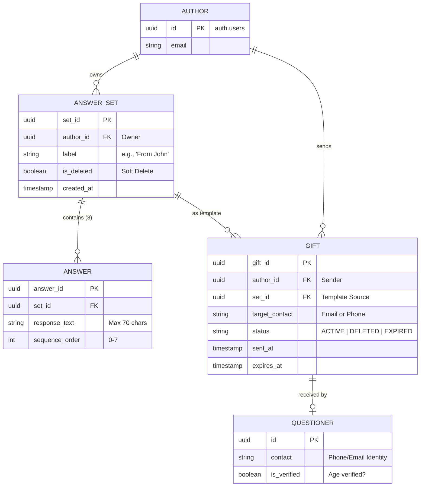

# Data Model: Author / AnswerSet / Gift / Questioner (008)

**Feature Branch**: `008-author-library-gifting`  
**Status**: Formalized

## 1. Entity Relationship Model

This model separates **templates** (`AnswerSets`) from **deliveries** (`Gifts`), ensuring Authors can manage their library as a reusable catalog while tracking individual mystical gifts to Questioners.

## 2. Table Definitions (Postgres)

### 2.1 Table: `answer_sets` (Extended)
- `set_id`: UUID (Primary Key)
- `author_id`: UUID (FK to auth.users)
- `label`: TEXT (Default: 'Mystic Responses')
- `is_deleted`: BOOLEAN (Default: FALSE)
- `status`: TEXT (DRAFT / ACTIVE / ARCHIVED)

### 2.2 Table: `answers` (Unchanged)
- `answer_id`: UUID (PK)
- `set_id`: UUID (FK)
- `response_text`: VARCHAR(70) 
- `sequence_order`: INT (Index)

### 2.3 Table: `gifts` (NEW)
- `gift_id`: UUID (PK)
- `author_id`: UUID (FK to auth.users)
- `set_id`: UUID (FK to answer_sets)
- `target_contact`: TEXT (Recipient Identity)
- `status`: TEXT (ACTIVE, DELETED, EXPIRED)
- `sent_at`: TIMESTAMPTZ (Default: NOW())
- `expires_at`: TIMESTAMPTZ

## 3. Row Level Security (RLS) Logic
- **`answer_sets`**: 
  - `SELECT`: `auth.uid() = author_id`
  - `UPDATE`: `auth.uid() = author_id` & `NOT is_deleted`
- **`gifts`**:
  - `SELECT`: `auth.uid() = author_id` OR `target_contact matches user identity`
  - `INSERT`: `auth.uid() = author_id` (Authors can send gifts)
- **`answers`**:
  - `SELECT`: Inherited via `AnswerSet` ownership/gift access.
